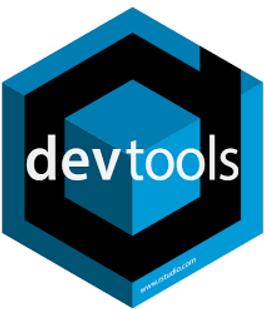
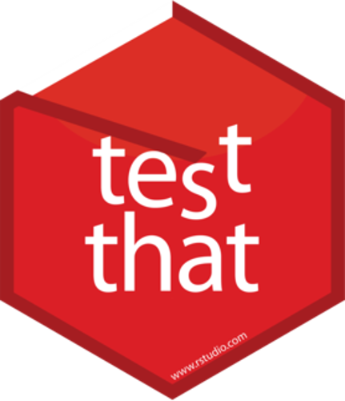
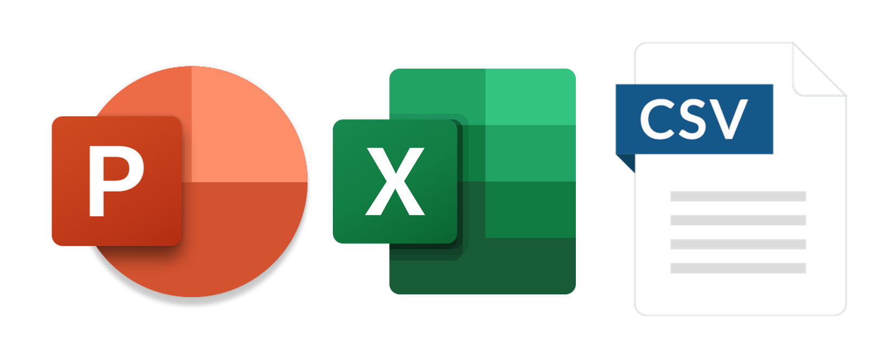

# De que *SI* se hablará

* Estrategias y metodologías de trabajo
* Escritura y buenas prácticas

## De que no se hablará...

* Detalles técnicos de ingeniería de software
* DevOps - Repositorios, CD & CI
* Consumo - API y WebApp (Plumber y Shiny)

---

class: middle

# ¿Por qué R?

--

* R junta de forma natural el poder analítico y estadístico con habilidades de producción.

--

* Es más cómodo para aquellos que venimos de los colegios de matemáticas/estadística.

--

* Numerosos paquetes que hacen fácil su integración con otras tecnologías.

---

class: chapter-slide

# ¿Por qué es importante automatizar?

---

 
**Buscas robustez, reproducibilidad y eficiencia.**

--

.pull-left[
  ## Tiempo
  * Pocos procesos que se repetirán de forma idéntica a futuro
]

--

.pull-right[
  ## Volumen
  * Muchos procesos idénticos en corto tiempo
]

---

.pull-left[
  ## Problema
  Estás en una **consultora de marketing** y hacen levantamientos mensuales de 1000 personas sobre la opinión de un conjunto de 10 marcas.
  
  La compañía necesita hacer una **segmentación de consumidores** por marca una vez que acabe el levantamiento, que pueda ser fácilmente interpretable por cualquier persona.
]

--

.pull-right[
  ## Objetivo
  Automatizar este proceso mediante un paquete en `R`, que sea capaz de leer los datos de la encuesta, aplique un modelo de **k-means**, resuma y genere un reporte en PowerPoint por cada marca.
  
  Poner este paquete en **producción**. Que otras personas puedan consumirlo.
]

---

class: chapter-slide

# ¿Cómo empezar a desarrollar?

---

Preguntas naturales: 
* ¿Por donde empiezo?
* ¿En cuánto tiempo puedo terminar el desarrollo del paquete?
* ¿Cuánto esfuerzo requerirá? ¿Necesito ayuda de alguien más?

--

### Apégate a una metodología de desarrollo

* **SCRUM**
* eXtreme Programming (XP)
* Lean Agile Process
* Crystal Clear

---

class: middle-centered

---

class: center

---

class: chapter-slide

# El desarrollo

---

# Creación del paquete

Apoyarte de paquetes como  

--

* Entre más dependencias tenga el paquete, mayor el tiempo que tendrás que dedicar para buscar actualizaciones, bugs resueltos.

---

# Escribir el código

.pull-left[

  * ¿Quién más lo va a leer?
  
  * Seguir el **teorema de la legibilidad**
  
  * Bien documentado
  
  * Apoyate de https://style.tidyverse.org/

]

.pull-right[

 
 
]

--

`devtools::lint()`

---

# Testing

.pull-left[
### Unitario

]

--

.pull-right[
###Regresion

]

---

#Crea un ecosistema (si es necesario)

--

* Un sólo paquete que haga muchas cosas puede ser enredado y complicado de mantener

--

---

class: chapter-slide

# Conclusiones

---

