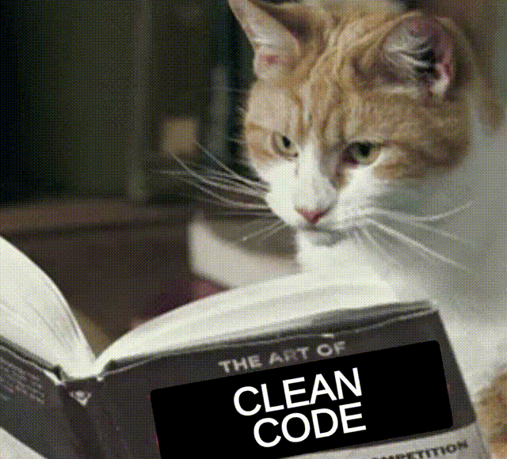
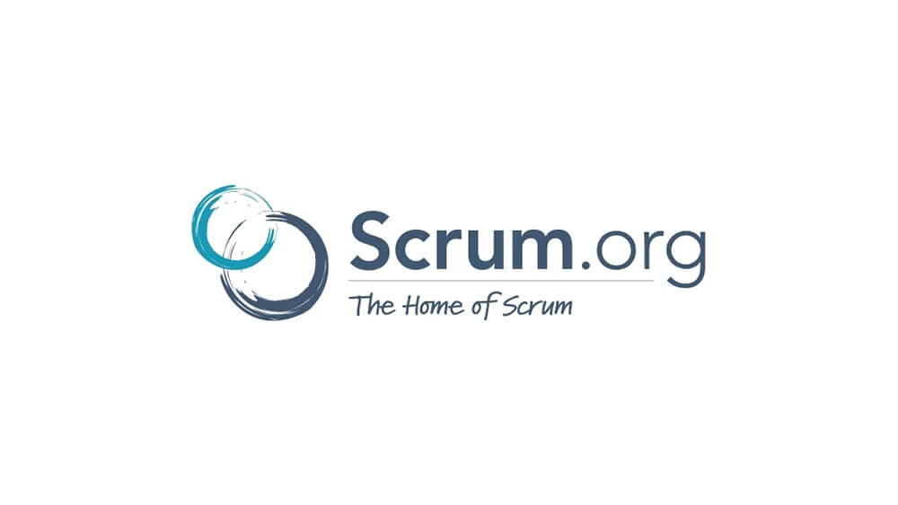
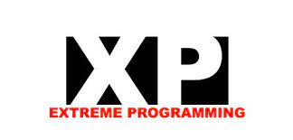
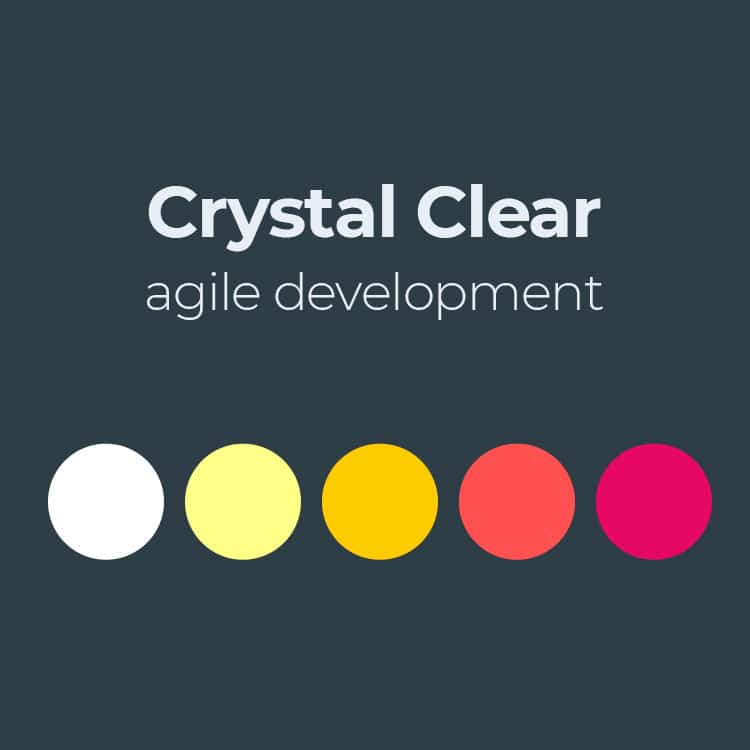

## De que **SI** se hablará

.pull-left[

* Estrategias y metodologías de trabajo
* Escritura y buenas prácticas

.center[

]

]

--

.pull-right[
## De que **NO** se hablará

* Detalles técnicos de ingeniería de software
* DevOps - Repositorios, CD & CI
* Consumo - API y WebApp (Plumber y Shiny)

.center[


]
]


---


class: middle

# ¿Por qué R?

--

* R junta de forma natural el poder **analítico y estadístico** con habilidades de producción.

--

* Numerosos paquetes que hacen fácil su **integración** con otras tecnologías.

--

* Es más cómodo para aquellos que empiezan a profundizar en el área de matemáticas/estadística.

--

* Tienen una comunidad es **diversa, extensa y activa**.


---

class: chapter-slide

# ¿Por qué es importante automatizar?

---

class: middle


.pull-left[
  ## Tiempo
  Tiempo límitado para correr un proceso.
]

--

.pull-right[
  ## Volumen
  Muchos procesos repetidos.
]

--

.center[

]


---

.pull-left[
  ## Problema
  Estás en una **consultora de marketing** y hacen levantamientos mensuales de 1000 personas sobre la opinión de un conjunto de 10 marcas.
  
  La compañía necesita hacer una **segmentación de consumidores** por marca una vez que acabe el levantamiento, que pueda ser fácilmente interpretable por cualquier persona.
]

--

.pull-right[
  ## Objetivo
  Automatizar este proceso mediante un paquete en `R`, que sea capaz de leer los datos de la encuesta, aplique un modelo de **k-means**, resuma y genere un reporte en PowerPoint por cada marca.
  
  Poner este paquete en **producción**. Que otras personas puedan consumirlo.
]

---

class: chapter-slide

# ¿Cómo empezar a desarrollar?

---

Preguntas naturales: 
* ¿Por donde empiezo?
* ¿En cuánto tiempo puedo terminar el desarrollo del paquete?
* ¿Cuánto esfuerzo requerirá? ¿Necesito ayuda de alguien más?

--

### Apégate a una metodología de desarrollo

--

.center[

]

--






---

class: middle-centered


---

class: center


---

class: chapter-slide

# El desarrollo

---

# Reproducibilidad

¿El código que escribí en mi computadora funcionará en la de mi compañero?

--

.center[
  
]

---

class: middle

Puedes apoyarte de `checkpoint` (o cualquier otro administrador de paquetes) para fijar un momento en el tiempo bajo el cuál se harán todas las instalaciones de paquetes.

```{r eval=FALSE}
library(checkpoint)
checkpoint::setSnaphot("12-11-2021")
```

--

* Es importante fijar las fechas en las que se actualizará el snapshot.

* Actualizar el snapshot **no** necesariamente implica actualizar la versión de R

---

class: middle


---

#Crea un ecosistema (si es necesario)

--

* Un sólo paquete que haga muchas cosas puede ser enredado y complicado de mantener

--

.center[

]

---

class: chapter-slide

# Eficiencia

---

Un usuario ha reportado que si el análisis se corre con 2,000 encuestados (el doble del original), este tarda demasiado y en algunas ocasiones arroja un error de `R` que es difícil interpretar...

--

.center[
  
]

---

* Encontrar cuellos de botella

```{r eval=FALSE}
profvis::profvis()
microbenchmark::microbenchmark()
```

* Paralelizar procesos

En matrices, listas, vectores...

```{r eval=FALSE}
parallel::parApply()
parallel::parLapply()
```

en ciclos

```{r eval=FALSE}
foreach::`%dopar%`()
```

---

# ¿Cómo poner en operación el paquete/shiny?

--

.center[
  
]

---

class: chapter-slide

# Conclusiones

---

* Adopta una metodología de desarrollo de software (Agile recomendado).

* Aprovecha el conocimiento del experto del producto, ayudará a definir mejor alcances y objetivos.

* Sigue las buenas prácticas de escritura y testeo, esto disminuirá la cantidad de bugs, que al final se traducen en pérdida económica, de tiempo y esfuerzo.

* Afina y perfila (Optimización de tiempo y memoria)

* Mantén comunicación con un equipo de tecnología: Ingenieros de datos, DevOps, Testers, etc.
